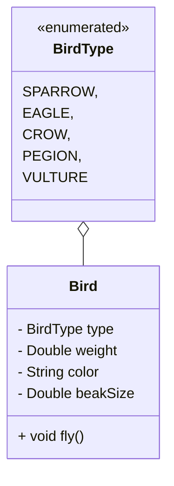
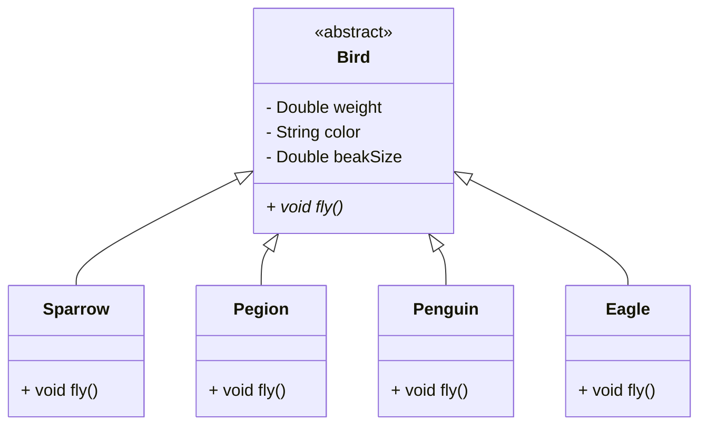
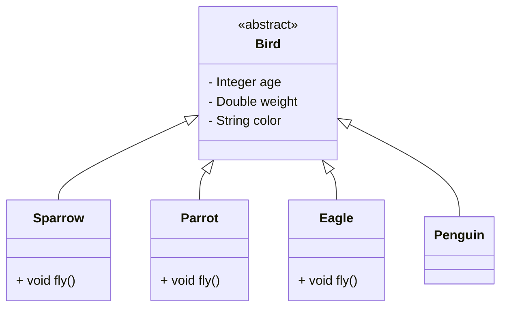
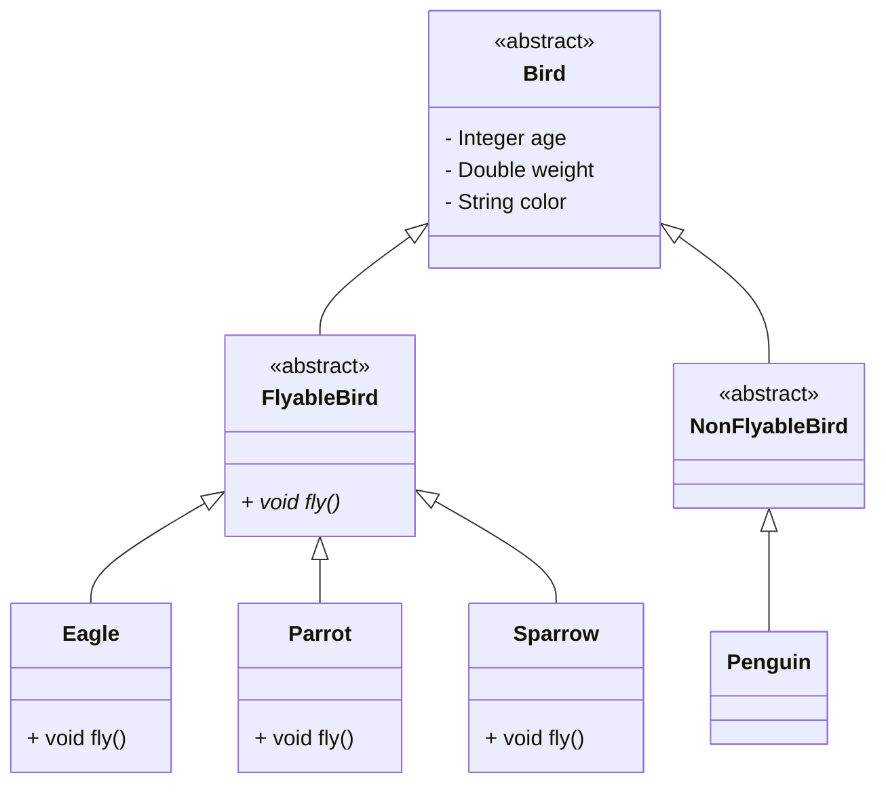
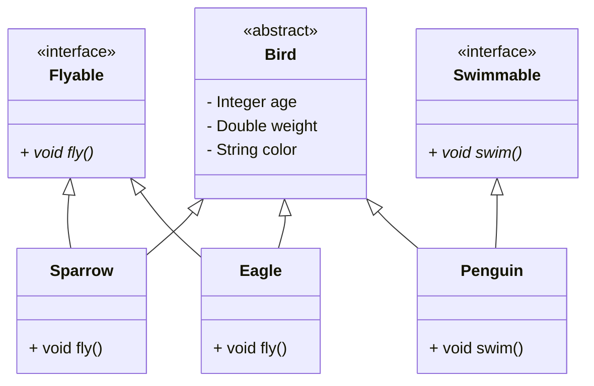

# DESIGN PRINCIPLES

## Contents

- [DESIGN PRINCIPLES](#design-principles)
  - [Contents](#contents)
  - [SOLID Design Principles](#solid-design-principles)
    - [Single Responsibilty Principle](#single-responsibilty-principle)
    - [Open/Close Principle](#openclose-principle)
    - [Liskov Substitution Principle](#liskov-substitution-principle)
    - [Interface Segregation Principle](#interface-segregation-principle)
    - [Dependency Inversion Principle](#dependency-inversion-principle)
      - [BIRD](#bird)
  - [KISS](#kiss)
  - [DRY](#dry)

What is good software?

- The code which is extensible, scalable and maintainable and which is working.

What are Design principles?

- Simply, we can say, the principles we need to follow to write maintainable, extensible and scalable code.

- To write maintainable and extensible code, we should understand coupling and cohesion.

- Software principles says code we write should be loose coupled, and highly cohesive.

**High cohesion**

- Similar things should be together(class/package/function)

**Low coupling**

- unrelated things should be seperate(class/package/function)

We generally use Object oriented programming concepts like encapsulation, abstraction, inheritance, polymorphism to write the good software.

## SOLID Design Principles

SOLID is accronym of

1. SINGLE RESPONSIBILTY PRINCIPLE
2. OPEN/CLOSE PRINCIPLE
3. LISKOV SUBSTITUTION PRINCIPLE
4. INTERFACE SEGREGATION PRINCIPLE
5. DEPENDENCY INVERSION

### Single Responsibilty Principle

It says
**One and only one reason to change**

### Open/Close Principle

It says
**Open for extension and closed for modification**

### Liskov Substitution Principle

It says
**The derived classes should be replacable with base class**

### Interface Segregation Principle

It says
**Interfaces should be as minimal as possible because the subclasses using the interface shouldn't face problem implementing the non-required methods**

### Dependency Inversion Principle

It says
**High level should depend on interfaces rather than concrete classes**

---

#### BIRD

Let's Design Bird for better understanding.



Let's implement the class and findout the problems

```java
package com.example.bird;

import lombok.Getter;

@Getter
public class Bird {

    private BirdType birdType;
    private Double weight;
    private String color;
    private Double beakSize;
    private Integer age;
    private Integer avgLifeSpan;

    private Bird() {

    }

    public static BirdBuilder builder() {
        return new BirdBuilder();
    }

    public static BirdBuilder sparrow() {
        return new BirdBuilder(BirdType.SPARROW);
    }

    public static BirdBuilder eagle() {
        return new BirdBuilder(BirdType.EAGLE);
    }

    public static class BirdBuilder {
        private Bird bird = new Bird();

        public BirdBuilder() {

        }

        public BirdBuilder(BirdType birdType) {
            this.bird.birdType = birdType;
        }

        public BirdBuilder birdType(BirdType birdType) {
            this.bird.birdType = birdType;
            return this;
        }

        public BirdBuilder color(String color) {
            this.bird.color = color;
            return this;
        }

        public BirdBuilder weight(Double weight) {
            this.bird.weight = weight;
            return this;
        }

        public BirdBuilder beakSize(Double beakSize) {
            this.bird.beakSize = beakSize;
            return this;
        }

        public BirdBuilder age(Integer age) {
            this.bird.age = age;
            return this;
        }

        public BirdBuilder lifeSpan(Integer lifeSpan) {
            this.bird.avgLifeSpan = lifeSpan;
            return this;
        }

        public Bird build() {
            if (valid(this.bird)) {
                return this.bird;
            }

            throw new RuntimeException("invalid field");
        }

        private boolean valid(Bird bird2) {
            if (bird2.birdType == null)
                return false;
            return true;
        }

    }

    public void fly() {
        switch (this.birdType) {
            case SPARROW:
            case PEGION:
            case CROW:
                System.out.println("flapping like " + this.birdType);
                break;

            case EAGLE:
            case VULTURE:
                System.out.println("gliding like " + this.birdType);
                break;

            case PENGUIN:
                System.out.println("Can't fly i'm " + this.birdType);
                break;

            default:
                throw new RuntimeException(this.birdType + " is invalid");
        }
    }
}

```

In the above code, there are problems like,

1. Not Readable (i.e. to find flying behaviour of one type of bird)
2. Not Reusable (i.e. tomorrow someother wanna use same code then we can't use it.)
3. Not Maintainable (i.e. some new developer wanna make changes then it is problematic )
4. Not Extensible (i.e. tommorow we wanna add new type of bird then we need to open class instead of extending)

It clearly says this code is not good.

What about the SRP
Yes it is not following SRP

Because
**We need to open class for changing flying behaviour of any type of bird, too many reasons to change**

What about the OCP
Not Following the OCP
Because
**We need to open class adding new type of bird, which fails closed for modification**

To solve this issue we use inheritance.



```java
@Getter
public abstract class Bird {

    private Double weight;
    private String color;
    private Double beakSize;
    private Integer age;
    private Integer avgLifeSpan;

    @Getter
    public static abstract class BirdBuilder {
        private Double weight;
        private String color;
        private Double beakSize;
        private Integer age;
        private Integer avgLifeSpan;

        public BirdBuilder color(String color) {
            this.color = color;
            return this;
        }

        public BirdBuilder weight(Double weight) {
            this.weight = weight;
            return this;
        }

        public BirdBuilder beakSize(Double beakSize) {
            this.beakSize = beakSize;
            return this;
        }

        public BirdBuilder age(Integer age) {
            this.age = age;
            return this;
        }

        public BirdBuilder lifeSpan(Integer lifeSpan) {
            this.avgLifeSpan = lifeSpan;
            return this;
        }

        public Bird build(Bird bird) {
            bird.age = this.age;
            bird.avgLifeSpan = avgLifeSpan;
            bird.beakSize = this.beakSize;
            bird.color = this.color;
            bird.weight = this.weight;
            return bird;
        }

    }

    public abstract void fly();

}


```

```java

public class Eagle extends Bird {

    private Eagle() {
    }

    public static EagleBuilder builder() {
        return new EagleBuilder();
    }

    public static class EagleBuilder extends BirdBuilder {

        public EagleBuilder weight(Double weight) {
            super.weight(weight);
            return this;
        }

        public EagleBuilder color(String color) {
            super.color(color);
            return this;
        }

        public EagleBuilder beakSize(Double beakSize) {
            super.beakSize(beakSize);
            return this;
        }

        public EagleBuilder age(Integer age) {
            super.age(age);
            return this;
        }

        public EagleBuilder lifeSpan(Integer lifeSpan) {
            super.lifeSpan(lifeSpan);
            return this;
        }

        public Bird build() {
            Bird eagle = new Eagle();
            super.build(eagle);

            return eagle;
        }
    }

    @Override
    public void fly() {
        System.out.println("Fly like eagle");
    }

}


```

Here it solves the SRP and OCP problems.

But what about the penguin, which can't fly?

We are forcing penguin to implement the fly as we have contract with bird class. which violates LSP.

Then how?

---

So let's moving fly method from parent class to child class.



But if there is no contract for fly method, each class might give naming differently and also there is no way to group flying birds together.

So, we comeup with abstract classes



But Penguin will swim and some other bird will have some other functionality. That results in many permutation classes (Flyable, Swimmable, NonFlyable, SwimmableNonFlyable, SwimmableFlyable)

so it results in too many classes(class Explosion).

so we look forward for interfaces.



For suppose after flying birds will sleep, even though sleep follows fly we shouldn't put them together, rather create new interface

This is what Interface segregation says, keep interfaces as small as possible, such that it follows high cohesion and low coupling.

## KISS

KISS is accronym for
Keep It Simple Stupid

## DRY

DRY is accronym for Don't Repeat Yourself
